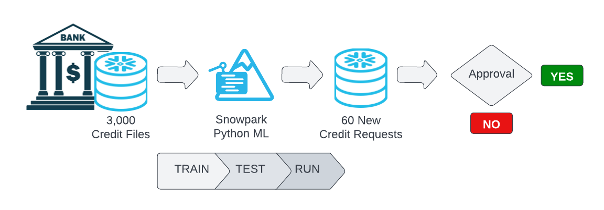

# Snowpark Credit Scoring Example

## 1. Overview

In this example, you will be able to use Snowpark for Python, along with your favorite python libraries for data analysis and visualization, as well as the popular scikit learn ML library to address an end to end machine learning use case.



## 2. Prerequisite

* Snowflake Account
* Client side snowpark environment with snowpark library installed. If you don't have any functional Snowpark environment, you can use the [icetire image](https://github.com/Snowflake-Labs/icetire):

  * Step 1: Open a terminal and run the following command:
  ```
  docker pull ghcr.io/snowflake-labs/icetire
  docker run -p 8888:8888 --name snowpark-lab ghcr.io/snowflake-labs/icetire:latest
  ```
  * Step 2: This will give the URL to access the Jupyter Environment
  * Step 3: Follow instructions in the Snowflake documentation on how to install the snowpark library.

## 3. What you'll learn

- Get an understanding on how to implement an end-to-end ML pipeline using Snowpark for Python.
- Develop using Snowpark for Python API, and Snowpark for Python UDFs, vectorized UDFs and Stored Procedures.
- Data Exploration, visualization and preparation using Python popular libraries (Pandas, seaborn).
- Machine Learning using scikit-learn python package
- Deploying and using an ML model for scoring in Snowflake using Snowpark for Python.

## 4. Usage/Steps

* Step 1: Run through the Credit Scoring Setup Notebook. This will download the dataset, and create the database and tables needed for this demo. Make sure to customize creds.json
* Step 2: You can now run the Credit Scoring Demo.

If you are using icetire, throughout this process, if you see errors about Python packages not found in your conda environment, you can simply install them through a pip command directly in the Setup notebook as shown in the Section 2. Python Librairies.
